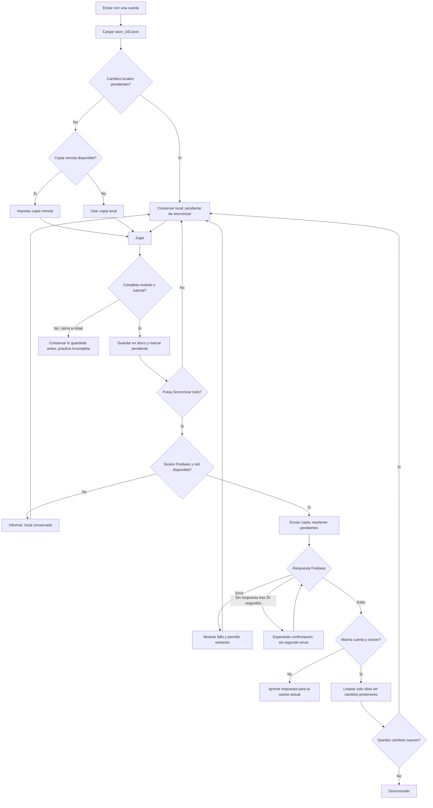

# Guardado hibrido — parte 1

## Alcance implementado
- Completar modulo/tutorial y crear partida escriben localmente.
- Las practicas no se reanudan a mitad de modulo.
- Sincronizar todo es una accion manual. Login y restauracion no suben datos.
- Eliminar modifica localmente y deja el slot vacio pendiente de sincronizar.
- Toda subida usa una copia independiente; el archivo conserva pendientes hasta confirmar.
- El ACK solo limpia slots que siguen identicos a los enviados.
- Respuestas de otra sesion no modifican los datos de la sesion actual.
- Un unico envio en curso; tras 20 segundos aparece espera de confirmacion.
- El panel de partidas muestra estado y permite subir tambien eliminaciones de slots vacios.

## Diagrama de estados actual

## Casos importantes
| Caso | Resultado |
|---|---|
| Cerrar despues de completar sin sincronizar | Completitud local conservada, pendiente de subir |
| Cerrar a mitad de practica | No se conserva el estado intermedio |
| Volver con la misma cuenta y cambios pendientes | Se conserva el local, sin subida automatica |
| Otra cuenta | Otro archivo local por UID |
| Eliminar sin conexion | Slot vacio local pendiente; no se restaura la copia remota en login |
| Modificar progreso durante subida | La copia enviada se confirma; cambios nuevos siguen pendientes |
| Cerrar antes de confirmar | El disco mantiene pendientes aunque el servidor pudiera haber recibido la copia |
| Cambiar cuenta durante subida | La operacion puede terminar para el UID original, pero su respuesta no toca la cuenta nueva |
| Servidor tarda | Espera visible; no se inventa exito ni cancelacion |
| Fallo escribiendo confirmacion local | Se conservan pendientes; se informa que Firebase recibio la copia |

## Parte 2 pendiente: conflictos y recuperacion
Esta entrega NO completa una estrategia multidispositivo. FirebaseSaveManager aun
reemplaza todo saveData. No sincronizar dos dispositivos con cambios independientes
esperando que se combinen automaticamente. La siguiente parte necesita revisiones
remotas y escritura condicional/transaccion, deteccion de conflictos y decisiones
visibles para conservar local o remoto con respaldo previo.

Tambien quedan para esa etapa: recuperacion de archivos corruptos con copia de
seguridad, descarga con errores diferenciados y tiempo limite uniforme, y prueba
integrada en visor/Firebase. La interfaz de esta parte usa el estado de cada tarjeta
de partidas, no una pantalla modal nueva.

## Validacion
Compilacion de Assembly-CSharp sin errores (dos avisos TMP previos).
Tests/SaveSafety ejecuta 15 comprobaciones del SaveManager real con transporte
Firebase simulado y archivos reales de prueba en Temp/SaveSafety. No contacta Firebase.
