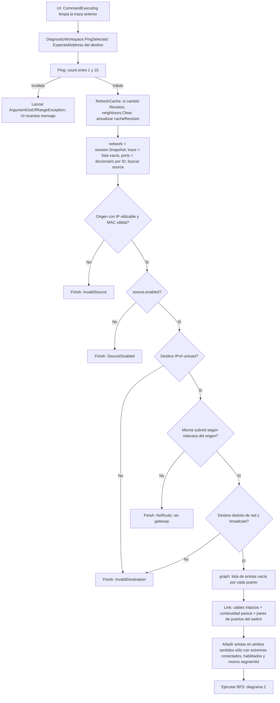
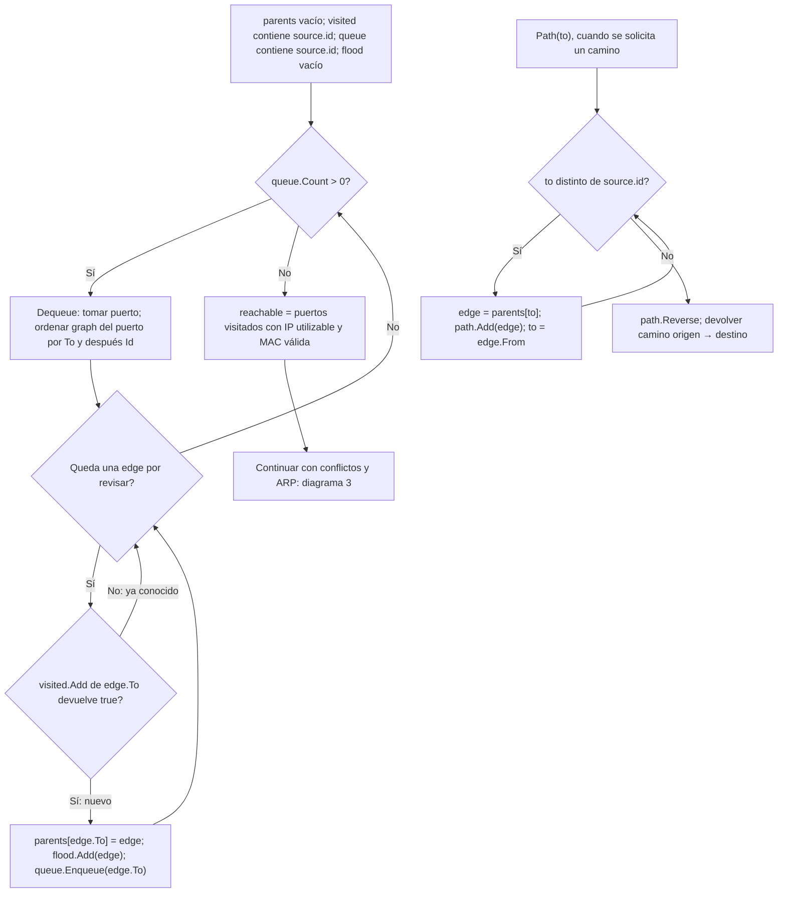
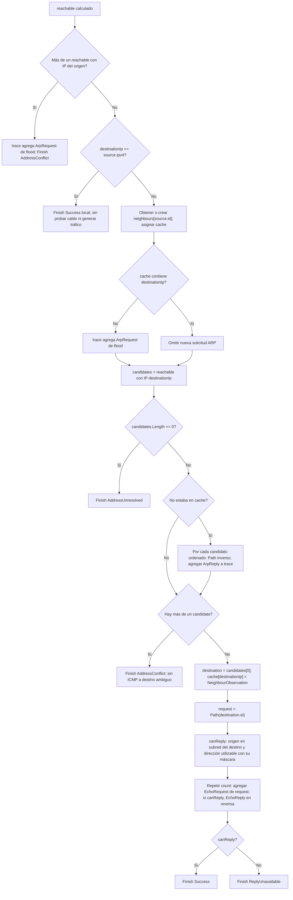
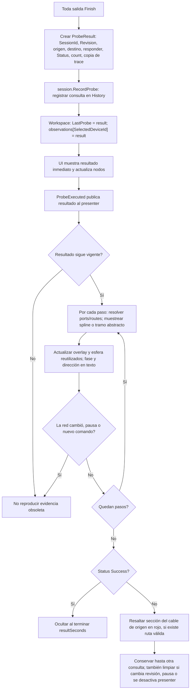

# Flujo completo de la simulación de ping

Describe el código actual de NetworkSimulationService.Ping, no una pila de red del sistema operativo. La conectividad se calcula antes de animar. BFS descubre alcance en el modelo; no sustituye ARP real ni implementa STP.

## Datos que utiliza

| Nombre real | Tipo / contenido | Función |
| --- | --- | --- |
| network | NetworkDefinition | Snapshot de la sesión para esta consulta. |
| ports | Dictionary<string, PortDefinition> | ID de puerto → configuración. |
| graph | Dictionary<string, List<Edge>> | ID de puerto → conexiones operativas bidireccionales. |
| visited | HashSet<string> | Puertos ya descubiertos por BFS; evita ciclos. |
| queue | Queue<string> | Puertos pendientes de explorar. |
| parents | Dictionary<string, Edge> | Puerto descubierto → arista por la que se llegó por primera vez. |
| flood | List<Edge> | Árbol de descubrimiento BFS usado para representar difusión ARP. |
| reachable | PortDefinition[] | Puertos visitados que tienen IPv4 utilizable y MAC válida. |
| neighbours | Dictionary<string, Dictionary<string, NeighbourObservation>> | Puerto de origen → tabla IP → observación ARP. Persiste entre consultas de la misma revisión. |
| cache | Dictionary<string, NeighbourObservation> | Referencia a neighbours[source.id] para la consulta. |
| candidates | PortDefinition[] | Interfaces alcanzables que reclaman destinationIp. |
| request | List<Edge> | Camino hasta el destino reconstruido por Path usando parents. |
| trace | List<ProbeTraceStep> | Fases ARP/ICMP y tramos que después reproduce la presentación. |

## 1. Entrada, validación y grafo

El for anidado del switch usa `i` y `j = i + 1`: enumera cada pareja una sola vez. `Link` crea ambas direcciones; no hace falta repetir la pareja invertida. No representa aprendizaje de tabla MAC.

## 2. BFS y reconstrucción

`parents` guarda por dónde se llegó; `visited` guarda a quién se llegó. El orden estable hace reproducibles las pruebas. Se recorre todo el componente alcanzable, no sólo hasta encontrar el destino: esto permite detectar respuestas ARP contradictorias.

## 3. ARP, conflictos e ICMP

ARP asocia IP a MAC/interfaz, no calcula rutas de Internet. Aquí la caché sólo aprende un candidato único. En el modelo, la IP del origen duplicada se comprueba antes del ping local. Una IP duplicada en un equipo no alcanzable no aparece como conflicto remoto.

## 4. Resultado, historial y presentación

La sección roja es una anotación de fallo, no un tramo por el que pasó una trama. Cerrar con A conserva ese estado final; cerrar una animación todavía en curso la cancela. Rayos X sólo cambia profundidad de renderizado; no modifica `graph`, `neighbours`, `trace` ni el resultado.

## Scripts implicados

| Script | Función |
| --- | --- |
| NetworkSimulationService.cs | Flujo principal, BFS, ARP, ICMP y caché. |
| NetworkSession.cs | Snapshot, revisión y registro del resultado. |
| ProbeResult.cs | Resultado y traza inmutables expuestos a presentación. |
| DiagnosticWorkspace.cs | Selección de destino y observaciones por equipo. |
| DiagnosticScreenController.cs | Comandos, resultados y eventos de presentación. |
| ProbeTracePresenter.cs | Animación y señal persistente sin modificar dominio. |

Limitaciones deliberadas: sin STP, tabla MAC del switch, tormentas, temporizadores ARP, pérdida aleatoria ni sockets reales. `Sent` cuenta intentos solicitados; `Received` vale count sólo en Success. El modelo no produce éxito parcial.

## Refactorización de legibilidad

El algoritmo anterior conserva el mismo orden y resultados. `Ping` ahora delega en métodos con una responsabilidad:

| Método actual | Función |
| --- | --- |
| ValidatePing | Validar origen, habilitación, destino y subred antes de construir conexiones. |
| BuildOperationalGraph | Crear graph con enlaces habilitados y cables íntegros. |
| TraverseBreadthFirst | Devolver Traversal con Parents, Visited y Flood; queue sigue siendo local al recorrido. |
| FindAddressablePorts | Filtrar reachable por IP/MAC válidas. |
| ReconstructPath | Reconstruir el camino que antes calculaba la función local Path. |
| CanReply | Comprobar subred/máscara de retorno. |
| AppendEchoAttempts | Registrar intentos ICMP y respuestas cuando hay retorno. |

En los diagramas anteriores, `parents`, `visited` y `flood` corresponden ahora a `traversal.Parents`, `traversal.Visited` y `traversal.Flood`; son los mismos datos agrupados en Traversal. No se añadieron hilos ni se cambiaron las reglas ARP.
