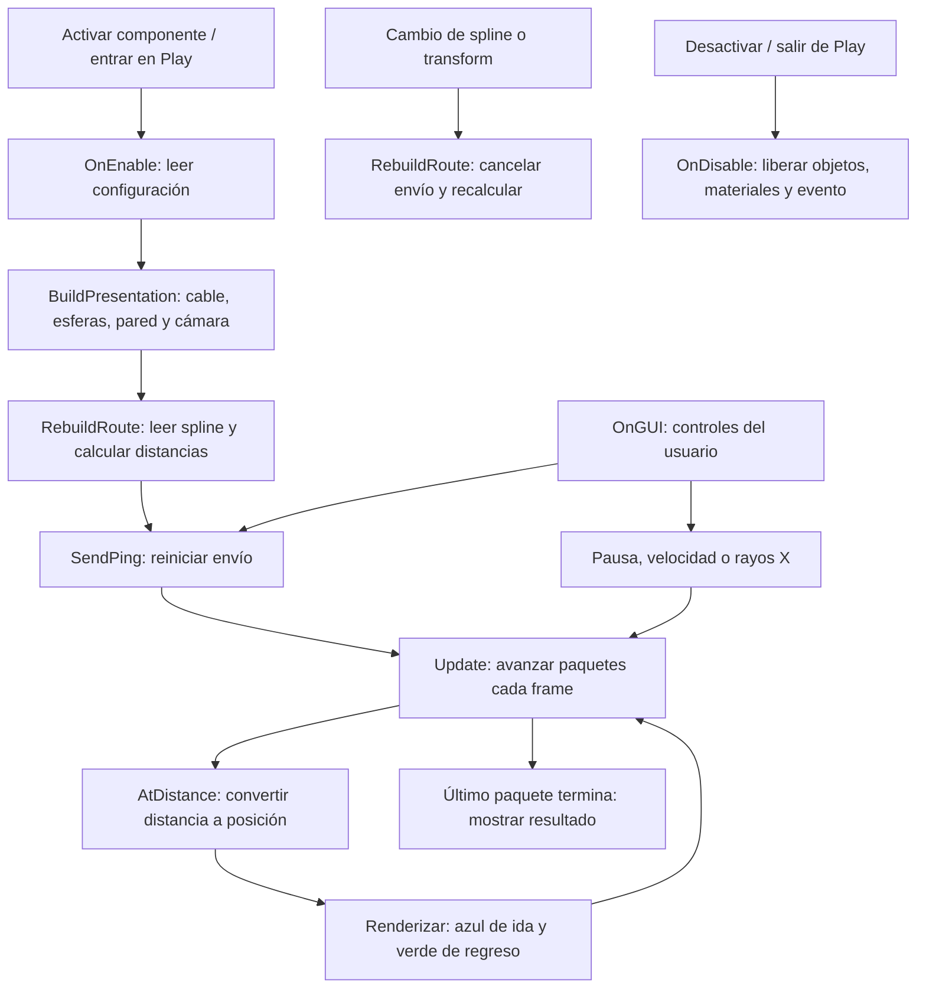

# Ejemplo de spline y paquetes en NoVRScene

Este ejemplo es una demostración visual aislada, anterior a los sprints del módulo 3. No implementa IP, ARP, diagnóstico real ni objetivos. Usa Unity Splines 2.8.4, ya instalado en el proyecto.

## Probar

1. Abrir `Assets/Scenes/NoVRScene.unity` y esperar la importación/compilación. Si ya estaba abierta, recargarla desde disco antes de guardar cambios sobre ella.
2. Pulsar Play y abrir la pestaña Game. La cámara de la demostración encuadra el ejemplo automáticamente y comienza un envío de cuatro paquetes.
3. Azul representa solicitud A→B; verde, respuesta B→A. El botón permite repetirlo. La velocidad y la pausa solo afectan la representación visual.
4. Activar **Rayos X** para ver el cable y paquetes detrás de la pared central. Desactivarlo para comparar la oclusión normal.
5. Activar **Simular interrupción**: los paquetes se detienen al 56% del recorrido y no regresan; una esfera roja identifica el fallo didáctico. Cambiar el modo reinicia la prueba.
6. Desactivar **Usar cámara de demostración** para volver a las cámaras originales. Salir de Play elimina todos los objetos visuales generados.

El objeto raíz `SplinePacketDemo` está en X=20, separado del contenido previo. No se alteran los objetos, cámaras ni scripts anteriores. La cámara temporal dibuja por encima mientras está activada. Los controles son IMGUI para ratón, exclusivos de este prototipo NoVR; no son la UI definitiva de laptop/XRI.

## Editar el recorrido

1. Salir de Play para conservar los cambios.
2. Seleccionar `SplinePacketDemo` en Hierarchy y pulsar **F** en Scene para encuadrarlo. Mantener Gizmos activado para ver la previsualización azul.
3. En el componente **Spline Container**, usar las herramientas de edición de Splines para seleccionar y mover los seis knots y ajustar sus tangentes. También se pueden editar sus datos en el Inspector del paquete.
4. Guardar la escena y volver a Play. El cable y los paquetes usan el nuevo recorrido. Si se cambia mucho su extensión, quizá haya que ajustar la cámara del prototipo.

Se utiliza la primera spline del contenedor y debe ser abierta con al menos dos puntos. El ejemplo dibuja un **LineRenderer** que muestrea la curva: permite comprobar el trazado y tráfico sin introducir todavía una malla tubular con Spline Extrude. Las curvas sí pertenecen al paquete Unity Splines y son editables con sus herramientas.

## Configuración y funcionamiento

### Responsabilidad de cada archivo

| Archivo o componente | Función |
| --- | --- |
| `SplinePacketDemo.cs` | Crea la presentación, muestrea la ruta, anima paquetes y atiende los controles. |
| `SplinePacketDemoSettings.cs` | Define los campos configurables del ScriptableObject. |
| `SplinePacketDemoSettings.asset` | Guarda los valores concretos que utiliza esta escena. No es un script. |
| `SplineDemoUnlit.shader` | Dibuja colores y controla la profundidad para oclusión normal o rayos X. |
| `SplineContainer` | Componente del paquete Unity Splines que almacena los puntos y tangentes del recorrido. |

### Orden básico de ejecución

`OnGUI` y el renderizado son callbacks/fases gestionados por Unity; el diagrama muestra dependencias, no un orden rígido entre ellos. `OnDrawGizmos` previsualiza la curva fuera de Play. Tras cambiar la ruta, se debe ejecutar un nuevo ping. La animación es visual: el resultado se decide por el modo de fallo seleccionado, no por una simulación de red.

- `Assets/GameData/Module03/SplinePacketDemoSettings.asset`: velocidad inicial, grosor, tamaño de paquetes, resolución de muestreo y colores. Los cambios de sliders durante Play no modifican el asset. Para aplicar cambios del asset, reiniciar Play.
- `SplinePacketDemo.cs`: genera la presentación al entrar en Play y reutiliza cuatro esferas. Una tabla de distancias aproxima la longitud de arco para mantener velocidad constante entre knots desiguales. Cambiar la spline o su transform cancela la prueba; ejecutar otra para usar la nueva ruta.
- `SplineDemoUnlit.shader`: material URP sin iluminación. Pared y extremos escriben profundidad; cable y paquetes la consultan normalmente y la ignoran al activar rayos X. Las referencias al shader son serializadas para evitar depender de Shader.Find.
- El fallo simulado no corta físicamente el cable ni deduce una causa a partir de ping: solo muestra cómo se representaría una interrupción conocida.

Verificación automática: compilación C# con referencias locales de Unity y revisión de referencias/IDs serializados. La apariencia, importación del shader e interacción en Game requieren prueba dentro del Editor; no se presentan como verificadas por la compilación.
